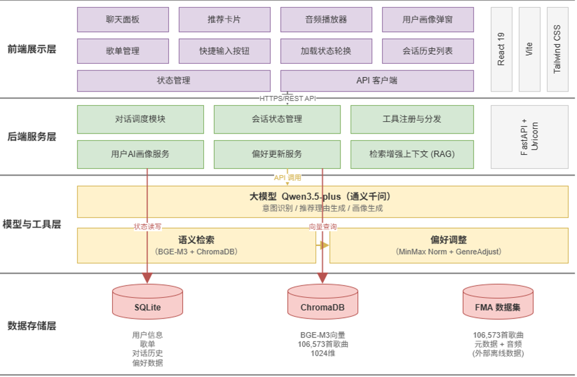
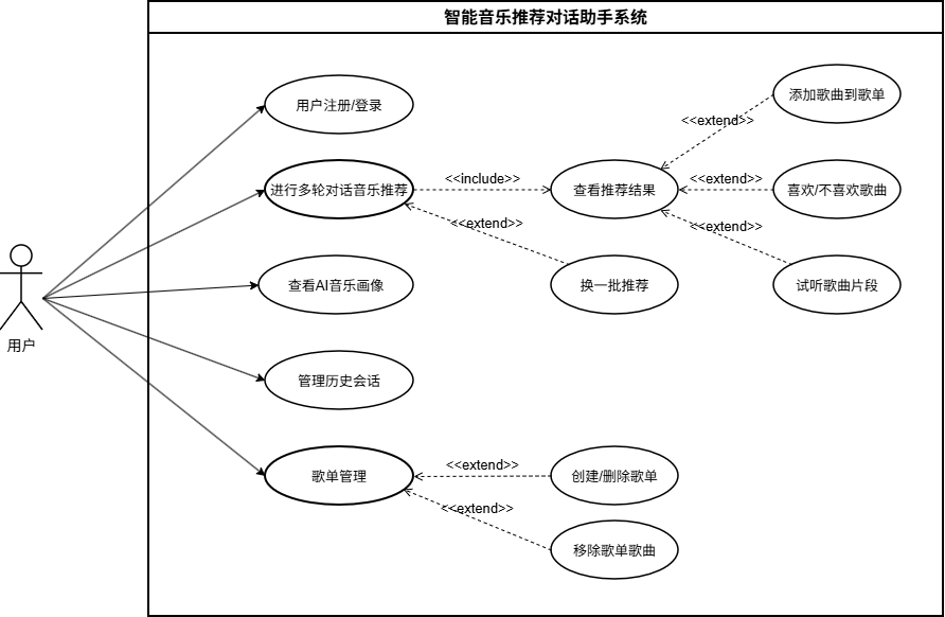
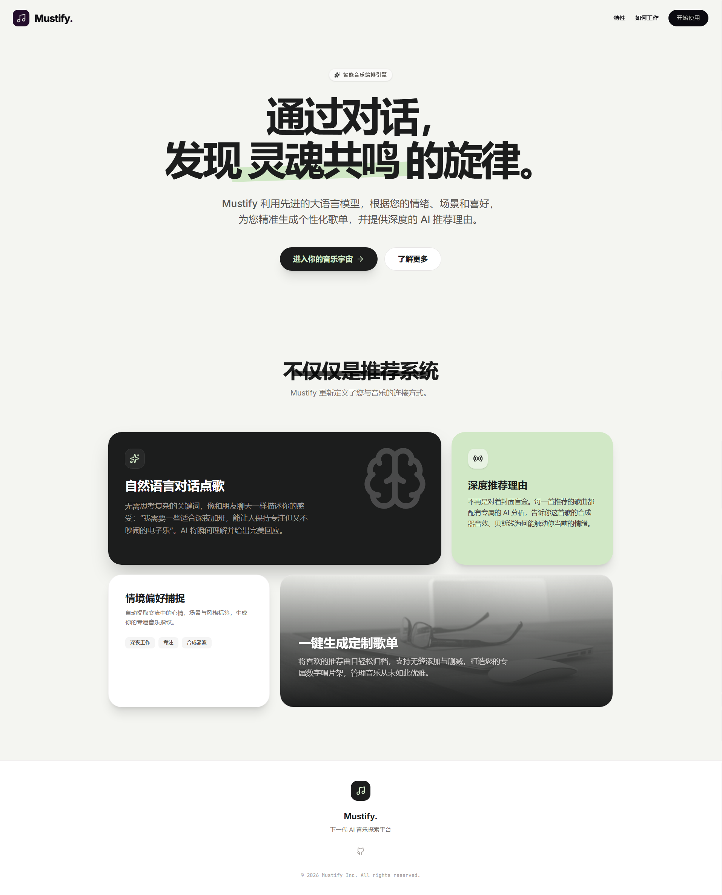
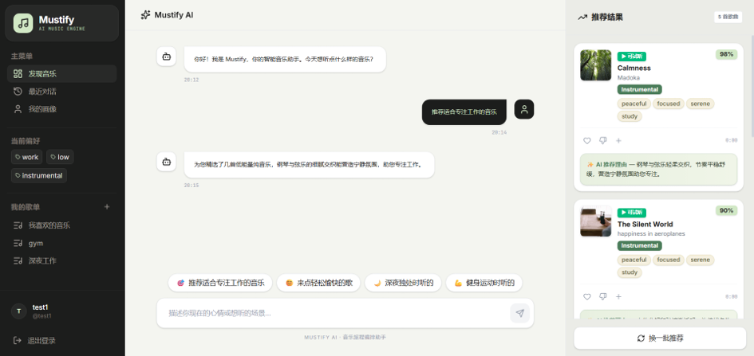
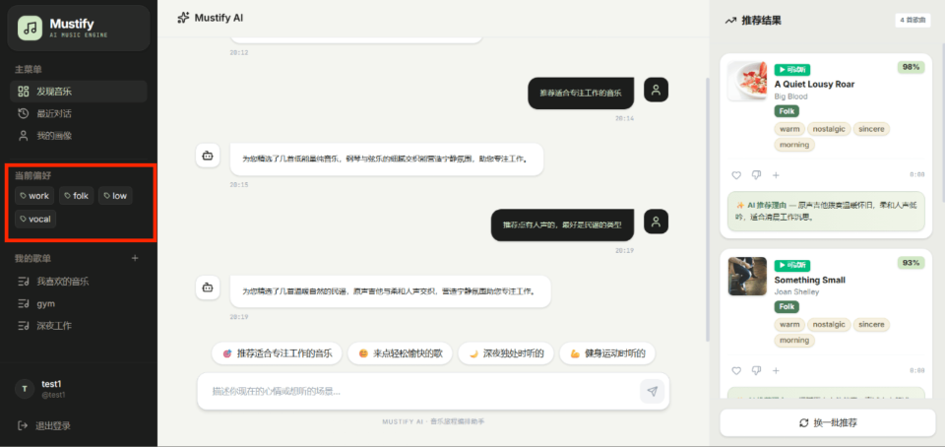
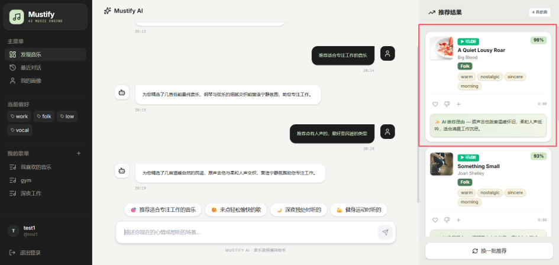
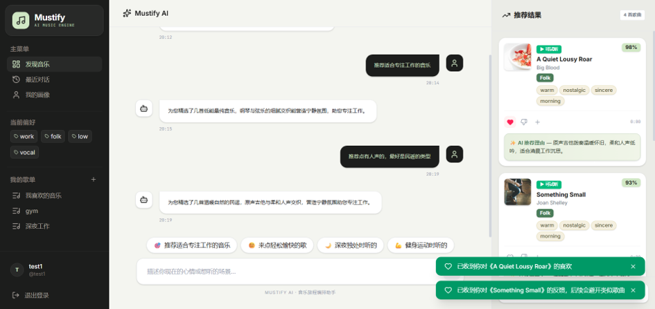
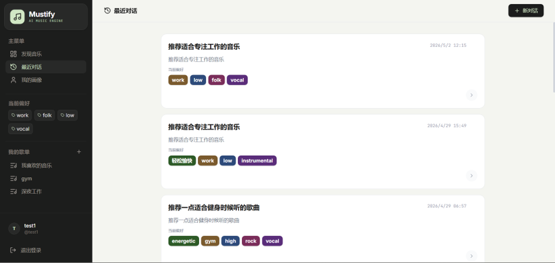
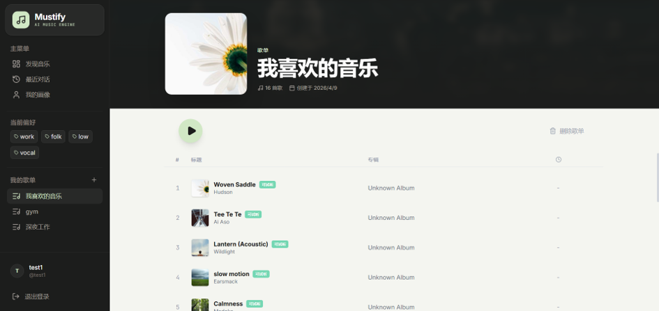
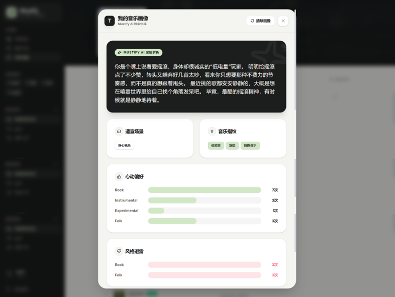

# 🎵 Mustify - 智能音乐推荐对话助手

[](https://www.python.org/)
[](https://fastapi.tiangolo.com/)
[](https://react.dev/)
[](https://www.typescriptlang.org/)
[](https://tailwindcss.com/)
[](https://opensource.org/licenses/MIT)

> 基于**语义检索架构**的智能音乐推荐对话助手，通过 BGE-M3 向量模型 + ChromaDB 语义搜索精准匹配歌曲，结合 LLM Agent 编排实现自然语言交互式推荐。

---

## 📖 目录

- [核心特性](#-核心特性)
- [系统架构](#-系统架构)
- [系统用例](#-系统用例)
- [界面展示](#-界面展示)
- [项目结构](#-项目结构)
- [快速开始](#-快速开始)
- [使用示例](#-使用示例)
- [API 参考](#-api-参考)
- [技术栈](#-技术栈)
- [测试](#-测试)
- [开发规范](#-开发规范)
- [已知限制](#-已知限制)
- [License](#-license)

---

## ✨ 核心特性

- 🧠 **语义检索推荐**
  - **向量检索**：BGE-M3 模型将用户查询转为 1024 维向量，ChromaDB 语义匹配
  - **精准匹配**：结合 FMA 元数据标签（genre/mood/energy）进行结果排序与筛选
- 🤖 **LLM Agent 编排** — 意图识别 → 槽位填充 → 工具调度 → RAG 上下文 → 响应生成
- 💬 **自然语言交互** — 中文/英文对话式推荐，支持多轮上下文与快捷输入
- 🎧 **在线试听** — 8000+ 首歌曲可直接在线播放
- 📊 **智能评分** — 基于排名和相似度的校准匹配指数（65-98%）
- 🌐 **现代 Web 界面** — React 19 + TypeScript + TailwindCSS v4 暗色主题
- 🔄 **反馈闭环** — Like/Dislike 反馈影响后续推荐排序，偏好自动记录到用户画像
- 🎨 **AI 用户画像** — 基于喜欢歌曲 + 对话历史 + 场景偏好，由 Qwen 生成个性化品味深度解读（缓存至 DB）
- 💾 **会话持久化** — SQLite 存储会话状态，重启后推荐历史不丢失
- 🎯 **快捷场景输入** — 预设快捷按钮：「推荐适合专注工作的音乐」「来点轻松愉快的歌」等

---

## 🏗️ 系统架构

<div align="center">
  
</div>


### 语义检索引擎

### 数据流

```
用户输入 → FastAPI (/chat) → Orchestrator (意图提取 + 槽位填充)
                                    │
                          ┌─────────┴─────────┐
                          ▼                   ▼
                    ToolRegistry       LLM (Qwen/Mock)
                          │                   │
                          ▼                   ▼
                  SemanticSearch ──► RAG Context Builder
                          │                   │
                          ▼                   ▼
                  ChromaDB 搜索 ──────► 响应合成 → 前端展示
                          反馈闭环更新偏好
```

---

## 🎯 系统用例

<div align="center">
  
</div>

系统提供三大核心用例：

1. **🎧 音乐推荐** — 对话式推荐、场景化推荐、换一批推荐
2. **👍 偏好管理** — Like/Dislike 反馈、歌单创建与管理、AI 用户画像
3. **💬 会话管理** — 多轮对话、历史回溯、会话重置

---

## 📸 界面展示

<div align="center">
  <h3>🏠 导航落地页</h3>
  
  <p><em>Mustify 品牌展示页，突出「智能对话、精准推荐、个性化体验」三大核心价值</em></p>
</div>

---

<div align="center">
  <h3>💬 对话主界面</h3>
  
  <p><em>三栏布局：侧边栏导航 + 中央对话区域 + 右侧推荐面板</em></p>
</div>

---

<div align="center">
  <h3>🎯 意图识别结果</h3>
  
  <p><em>LLM 实时解析用户意图，提取场景/风格/能量等槽位</em></p>
</div>

---

<div align="center">
  <h3>🎧 推荐结果</h3>
  
  <p><em>歌曲卡片展示：封面、标题、艺术家、流派标签、匹配度（92%）、可试听徽章、AI 推荐理由</em></p>
</div>

---

<div align="center">
  <h3>👍 偏好反馈交互</h3>
  
  <p><em>Like/Dislike 实时反馈、添加到歌单、Toast 提示</em></p>
</div>

---

<div align="center">
  <h3>📜 对话历史</h3>
  
  <p><em>历史会话卡片展示标题、创建时间、偏好标签（心情/场景/风格/能量），支持加载与删除</em></p>
</div>

---

<div align="center">
  <h3>📋 歌单详情页</h3>
  
  <p><em>歌单头部大图展示，歌曲列表含播放、移除操作</em></p>
</div>

---

<div align="center">
  <h3>🧑‍🎤 AI 用户画像</h3>
  
  <p><em>流派偏好柱状图、音乐指纹标签、适宜场景、AI 深度品味解读（Qwen 生成）</em></p>
</div>

---

## 📁 项目结构

```
music_agent/
├── src/                              # Python 后端源码
│   ├── agent/
│   │   ├── orchestrator.py          # 意图识别、工具调度、响应合成
│   │   └── mock_llm.py              # Mock LLM（开发测试用）
│   ├── api/                          # FastAPI 应用
│   │   ├── app.py                   # 主应用、路由、中间件
│   │   ├── auth.py                  # 认证（JWT）
│   │   ├── sessions.py              # 会话管理
│   │   ├── session_store.py         # 内存会话存储
│   │   ├── session_persistence.py   # 会话持久化
│   │   ├── playlist.py              # 歌单管理
│   │   ├── user.py                  # 用户管理
│   │   └── ai_portrait.py           # AI 用户画像 API
│   ├── llm/
│   │   ├── clients/
│   │   │   └── qwen_openai_compat.py  # Qwen (OpenAI-compatible)
│   │   └── prompts/                 # Prompt 模板
│   ├── rag/
│   │   ├── context_builder.py       # RAG 上下文构建
│   │   ├── retriever.py             # 文档检索
│   │   └── sanitize.py              # 注入防护
│   ├── tools/
│   │   ├── registry.py              # 工具注册表
│   │   └── semantic_search_tool.py  # 语义搜索工具
│   ├── searcher/
│   │   └── music_searcher.py        # ChromaDB + BGE-M3 搜索
│   ├── recommender/
│   │   └── music_recommender.py     # FMA 元数据相似度推荐
│   ├── manager/
│   │   └── session_state.py         # 会话状态管理
│   ├── models/
│   │   └── session_persistence.py   # 数据模型
│   └── services/
│       └── portrait_service.py      # 用户画像服务（Deep Analysis）
│
├── frontend/                         # React 前端
│   ├── index.html                   # HTML 入口
│   ├── vite.config.ts               # Vite 配置（含 API 代理）
│   ├── src/
│   │   ├── main.tsx                 # React 入口
│   │   ├── App.tsx                  # 路由定义
│   │   ├── index.css                # TailwindCSS 全局样式
│   │   ├── config/api.ts            # API 端点配置
│   │   ├── types/index.ts           # TypeScript 类型定义
│   │   ├── lib/utils.ts             # 工具函数
│   │   ├── services/                # HTTP 服务
│   │   │   ├── api.ts               # Axios 实例
│   │   │   ├── chat.ts              # 对话 API
│   │   │   ├── feedback.ts          # 反馈 API
│   │   │   ├── session.ts           # 会话 API
│   │   │   └── health.ts            # 健康检查
│   │   ├── store/                   # Zustand 状态管理
│   │   │   ├── useAuthStore.ts      # 认证状态
│   │   │   ├── useChatStore.ts      # 对话状态
│   │   │   ├── usePlaylistStore.ts  # 歌单状态
│   │   │   └── useProfileStore.ts   # 用户画像状态
│   │   ├── contexts/
│   │   │   └── AudioPlayerContext.tsx  # 音频播放器
│   │   ├── components/
│   │   │   ├── auth/                # 登录/注册
│   │   │   ├── pages/               # 页面组件
│   │   │   ├── layout/              # 布局组件
│   │   │   └── profile/             # 用户画像弹窗
│   │   ├── mappers/                 # 数据映射
│   │   └── mock/                    # 前端模拟数据
│   └── package.json
│
├── scripts/                          # 数据处理与工具脚本
│   ├── run_api.py                   # 启动 API
│   ├── chat_cli.py                  # 命令行对话
│   ├── vectorizer_bge.py            # 构建向量索引
│   ├── data_processor_bge.py        # 数据预处理
│   ├── build_metadata_from_json.py  # 元数据映射构建
│   └── build_audio_mapping.py       # 音频映射构建
│
├── tests/                            # 独立测试脚本
├── docs/
│   ├── diagrams/                     # 架构图与用例图
│   │   ├── 系统架构图.png
│   │   └── 系统用例图.png
│   └── screenshots/                  # UI 界面截图
│       ├── 导航页截图.png
│       ├── 对话主界面截图.png
│       ├── 意图识别结果截图.png
│       ├── 推荐结果截图.png
│       ├── 偏好反馈交互截图.png
│       ├── 对话历史截图.png
│       ├── 歌单详情页截图.png
│       └── 用户ai画像截图.png
│
├── requirements.txt                  # Python 依赖
└── README.md                        # 本文件
```

---

## 🚀 快速开始

### 前置依赖

- Python 3.11+
- Node.js 18+
- [FMA Small Dataset](https://github.com/mdeff/fma)（需手动下载）
- [Qwen API Key](https://dashscope.console.aliyun.com/)（可选，mock 模式无需）

### 1. 克隆与安装

```bash
git clone https://github.com/YoungB1oodXD/music-agent.git
cd music_agent

# 创建 Python 环境
conda create -n music_agent python=3.11 -y
conda activate music_agent

# 安装后端依赖
pip install -r requirements.txt

# 安装前端依赖
cd frontend && npm install && cd ..
```

### 2. 数据准备

```bash
# 下载 FMA Small 数据集到 dataset/raw/fma_small/

# 数据预处理
python scripts/data_processor_bge.py

# 构建向量索引
python scripts/vectorizer_bge.py

# 构建元数据映射
python scripts/build_metadata_from_json.py

# 构建音频映射
python scripts/build_audio_mapping.py
```

### 3. 配置与启动

```bash
# 设置 LLM 模式（默认为 mock）
# Windows
set MUSIC_AGENT_LLM_MODE=mock
# 或使用真实 Qwen API
set MUSIC_AGENT_LLM_MODE=qwen
set DASHSCOPE_API_KEY=your_api_key_here

# Linux/Mac
export MUSIC_AGENT_LLM_MODE=mock

# 启动后端（端口 8000）
python scripts/run_api.py

# 新终端：启动前端（端口 3000）
cd frontend && npm run dev
```

### 4. 访问

打开 **http://localhost:3000** 即可使用。

---

## 💡 使用示例

### 对话式推荐

```
你：推荐一些适合晚上一个人听的音乐
助手：为你找到以下适合夜间独处的歌曲：

🎵 Quiet Pages - Paper Lanterns
   流派：Lo-fi / 匹配度：91%
   理由：旋律轻柔、节奏缓慢，符合夜间放松的氛围

🎵 Soft Rain Notes - Window Seat
   流派：Ambient / 匹配度：88%
   理由：环境音乐风格，适合安静的夜晚

你：换成更欢快的
助手：好的，为你推荐更欢快的歌曲：
...
```

### 偏好反馈

```
你：来点高能量的跑步音乐
助手：已更新你的偏好（能量：高），为你推荐：

🎵 Caffeine Loop - Night Library
   流派：Electronic / 匹配度：93%
   理由：节奏明快、能量充沛，适合运动场景

（点击 ❤️ 喜欢）
系统：记录流派偏好（Electronic +1），更新能量偏好，下次推荐时自动加权融合
```

### 用户画像

```
点击「我的画像」→ 系统分析：
- 喜欢歌曲：Hip-Hop ×3, Jazz ×2, Electronic ×1
- 能量偏好：高（历史评分均值 3.5/5）
- AI 解读：「你偏好律动感强、情绪浓烈的音乐类型...」
```

---

## 🔧 API 参考

### 核心端点

| 方法 | 路径 | 说明 | 认证 |
|------|------|------|------|
| POST | `/chat` | 对话式推荐 | 可选 |
| POST | `/feedback` | 反馈（喜欢/不喜欢） | 必需 |
| POST | `/recommend/refresh` | 刷新推荐 | 必需 |
| POST | `/reset_session` | 重置会话 | 必需 |
| GET | `/sessions` | 会话列表 | 必需 |
| GET | `/sessions/{id}` | 会话详情 | 必需 |
| DELETE | `/sessions/{id}` | 删除会话 | 必需 |
| GET | `/playlists` | 歌单列表 | 必需 |
| GET | `/playlists/{id}` | 歌单详情 | 必需 |
| POST | `/playlists` | 创建歌单 | 必需 |
| POST | `/playlists/{id}/songs` | 添加歌曲 | 必需 |
| DELETE | `/playlists/{id}/songs/{track_id}` | 移除歌曲 | 必需 |
| DELETE | `/playlists/{id}` | 删除歌单 | 必需 |
| GET | `/api/ai/portrait` | 获取用户画像 | 必需 |
| DELETE | `/api/ai/portrait` | 清除用户画像 | 必需 |
| POST | `/auth/register` | 注册 | 否 |
| POST | `/auth/login` | 登录 | 否 |
| GET | `/health` | 健康检查 | 否 |

### `/chat` 请求示例

```json
{
  "session_id": "abc123",
  "message": "推荐适合学习的轻音乐"
}
```

### `/chat` 响应示例

```json
{
  "session_id": "abc123",
  "assistant_text": "为你找到以下适合学习的歌曲：",
  "recommendations": [
    {
      "id": "fma_000123",
      "title": "Quiet Pages",
      "artist": "Paper Lanterns",
      "reason": "旋律轻柔、节奏缓慢，适合学习场景",
      "is_playable": true,
      "audio_url": "/audio/fma_small/000/000123.mp3",
      "match_score": 91,
      "genre": "Lo-fi"
    }
  ],
  "state": {
    "current_scene": "学习",
    "current_mood": "平静"
  }
}
```

---

## 📊 技术栈

### 后端

| 技术 | 用途 |
|------|------|
| Python 3.11 | 运行环境 |
| FastAPI | Web 框架 |
| SQLAlchemy + SQLite | 数据持久化 |
| ChromaDB | 向量数据库 |
| BGE-M3 | 多语言向量模型（1024 维） |
| Qwen (DashScope) | 大语言模型 |

### 前端

| 技术 | 版本 | 用途 |
|------|------|------|
| React | ^19.0.0 | UI 框架 |
| TypeScript | ~5.8 | 类型安全 |
| Vite | ^6.2 | 构建工具 |
| TailwindCSS | ^4.1 | 原子化 CSS |
| Zustand | ^5.0 | 状态管理 |
| React Router | ^7.14 | 客户端路由 |
| Axios | ^1.14 | HTTP 客户端 |
| Lucide React | ^0.546 | 图标库 |
| Motion | ^12.23 | 动画引擎 |

### 关键参数

| 参数 | 值 | 说明 |
|------|-----|------|
| 向量维度 | 1024 | BGE-M3 输出维度 |
| 音乐规模 | 106,573 首 | FMA 元数据 |
| 可试听 | 8,000+ 首 | FMA Small |
| 推荐 Top-K | 5-20 | 可配置 |
| 匹配分数 | 65-98% | 校准后显示 |
| Like 加分 | +0.03/次 | 上限 +0.15 |
| Dislike 降权 | -0.05/次（≥3次触发） | 下限 -0.20 |
| RAG 上下文上限 | 1200 字符 | 可配置 |

---

## 🧪 测试

```bash
# 后端语法检查
python -m compileall src scripts tests

# Agent 编排测试
python tests/agent_orchestrator_smoke.py

# 工具注册测试
python tests/tool_registry_unit.py

# API 测试
python tests/api_chat_smoke.py

# 前端类型检查
cd frontend && npm run lint

# 前端 E2E 测试
cd frontend && npm run test:e2e
```

---

## 🛠️ 开发规范

### 代码风格

- **Python**: 4 空格缩进，类型提示，snake_case
- **TypeScript**: 2 空格缩进，PascalCase 组件，camelCase 变量
- **提交**: 使用 `git commit`，清晰描述改动

### 环境变量

| 变量 | 用途 | 默认值 |
|------|------|--------|
| `MUSIC_AGENT_LLM_MODE` | LLM 模式（mock/qwen） | `mock` |
| `DASHSCOPE_API_KEY` | DashScope API 密钥 | - |
| `DASHSCOPE_BASE_URL` | API 端点覆盖 | - |
| `DASHSCOPE_MODEL` | 模型名称覆盖 | - |
| `LOG_LEVEL` | 日志级别 | `INFO` |

### 相关文档

- [论文写作指南_20260416.md](论文写作指南_20260416.md) — 论文各章节写作参考

---

## ⚠️ 已知限制

- **多 Worker 部署**：当前 SessionStore 为进程内内存 + SQLite 持久化，多 Worker 部署时需引入 Redis 共享状态
- **Token 存储**：内存存储，重启后所有会话需重新认证
- **LLM 模式**：mock 模式使用确定性回复，qwen 模式需要 API Key
- **数据规模**：FMA Small 子集，非完整数据集
- **配置分散**：显示分数阈值同时定义在 `orchestrator.py` 和 `src/config.py`

---

## 📄 License

MIT License — 详见 [LICENSE](LICENSE) 文件

---

## 🙏 致谢

- [FMA Dataset](https://github.com/mdeff/fma) — Free Music Archive 数据集
- [BGE-M3](https://github.com/BAAI-bge/bge-m3) — BAAI 多语言向量模型
- [ChromaDB](https://www.trychroma.com/) — 向量数据库
- [Qwen](https://tongyi.aliyun.com/) — 阿里通义千问大模型
- [React](https://react.dev/) — UI 框架
- [TailwindCSS](https://tailwindcss.com/) — CSS 框架
